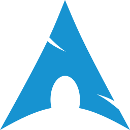

<samp>- hello! im fq0e. -</samp>
  
<samp>i use  and </samp>
 
<samp>i code in     and </samp>
  
<samp>- links -</samp>
 
<samp>
  <a href="https://twitter.com/epiconeshotfan5">twitter</a>
  <a href="https://lethallava.land/@fq">fediverse</a>
  <a href="https://bsky.app/profile/fq0e.dev">bluesky</a>
  <a href="https://fq0e.dev">website</a>
</samp>
  
<samp>- discord status -</samp>
 

   

